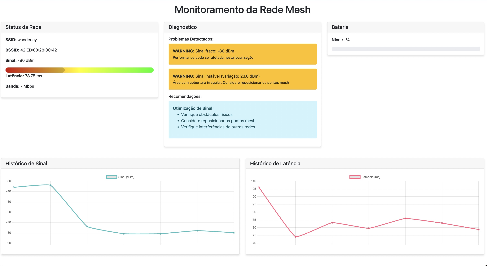

# Sistema de Monitoramento de Rede Wi-Fi Mesh


Um sistema completo para monitoramento e análise de redes Wi-Fi Mesh, desenvolvido para Raspberry Pi. Este projeto permite coletar, analisar e visualizar dados importantes sobre a performance da rede mesh.

## 🎥 Demonstração

### Interface Web



### Monitoramento em Tempo Real


### Vídeos de Demonstração

Para ver os vídeos de demonstração, por favor acesse:

- [Demonstração Completa](https://youtu.be/SEU_LINK_AQUI)
- [Teste de Performance](https://youtu.be/SEU_LINK_AQUI)
- [Funcionamento do Sistema](https://youtu.be/SEU_LINK_AQUI)

## 🚀 Funcionalidades

- 📡 Monitoramento de força do sinal Wi-Fi
- ⚡ Testes de latência entre nós da rede
- 📊 Análise de largura de banda
- 🔄 Detecção de handovers entre pontos de acesso
- 🔋 Monitoramento de bateria
- 📈 Interface web para visualização de dados
- 📝 Logging de dados em CSV/JSON
- 🔍 Diagnóstico avançado de problemas na rede

## 🛠️ Requisitos

- Raspberry Pi (testado no Raspberry Pi 4)
- Python 3.11 ou superior
- Acesso à rede mesh "wanderley"
- Bibliotecas Python listadas em `requirements.txt`

## 📦 Instalação

1. Clone o repositório:

```bash
git clone https://github.com/eduardowanderleyde/mester-programming.git
cd mester-programming
```

2. Instale as dependências:

```bash
pip install -r requirements.txt
```

3. Configure o ambiente:

```bash
chmod +x setup_raspberry.sh
./setup_raspberry.sh
```

## 🚀 Como Usar

1. Inicie o sistema principal:

```bash
python orquestrador2/main.py
```

2. Acesse a interface web:
   - Abra o navegador e acesse: `http://seu-raspberry-pi:5000`

## 📁 Estrutura do Projeto

```
orquestrador2/
├── main.py                 # Script principal
├── wifi_scanner.py         # Scanner de redes Wi-Fi
├── latency_test.py         # Testes de latência
├── bandwidth_test.py       # Testes de largura de banda
├── handover_test.py        # Monitoramento de handovers
├── data_logger.py          # Sistema de logging
├── mesh_analyzer.py        # Análise de dados da rede
├── mesh_diagnostics.py     # Diagnóstico de problemas
├── display.py              # Interface de visualização
├── web_interface.py        # Interface web
├── battery_monitor.py      # Monitoramento de bateria
├── config.py               # Configurações do sistema
└── templates/              # Templates HTML
    └── index.html          # Template da interface web
```

## 📊 Coleta de Dados

O sistema coleta os seguintes dados:

- Força do sinal Wi-Fi
- Qualidade da conexão
- Latência entre nós
- Largura de banda disponível
- Eventos de handover
- Status da bateria
- Diagnósticos de rede

## 📈 Análise de Dados

Os dados são analisados para:

- Identificar problemas de conectividade
- Otimizar a configuração da rede
- Detectar padrões de uso
- Prever possíveis falhas
- Sugerir melhorias na rede

## 🤝 Contribuições

Contribuições são bem-vindas! Por favor, siga estas etapas:

1. Fork o projeto
2. Crie uma branch para sua feature (`git checkout -b feature/AmazingFeature`)
3. Commit suas mudanças (`git commit -m 'Add some AmazingFeature'`)
4. Push para a branch (`git push origin feature/AmazingFeature`)
5. Abra um Pull Request

## 📝 Licença

Este projeto está sob a licença MIT. Veja o arquivo [LICENSE](LICENSE) para mais detalhes.

## ✨ Autores

- **Eduardo Wanderley** - *Desenvolvimento inicial* - [GitHub](https://github.com/eduardowanderleyde)

## 🙏 Agradecimentos

- À comunidade open source por todas as ferramentas utilizadas
- Aos mantenedores das bibliotecas Python utilizadas
- Aos contribuidores do projeto
